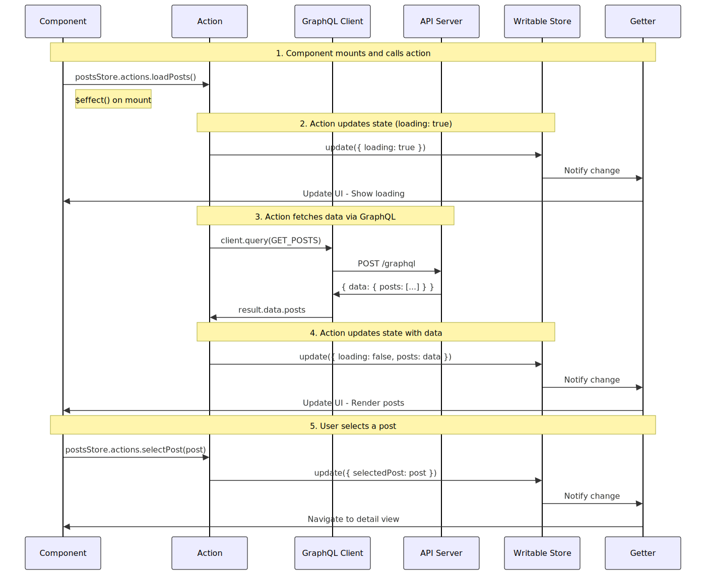

# Architecture Guide - Renardo Webclient Fresh

Une documentation complète de l'architecture et des conventions de l'application, basée sur les principes de [svelte_archi](../svelte_archi/svelte_app_scalable.md) et adaptée au contexte de Renardo Webclient Fresh.

## Table des matières

1. [Vue d'ensemble](#vue-densemble)
2. [Structure des dossiers](#structure-des-dossiers)
3. [Conventions de nommage](#conventions-de-nommage)
4. [Modèles de données](#modèles-de-données)
5. [Composants primitifs (Atomic Design)](#composants-primitifs-atomic-design)
6. [Composants de domaine](#composants-de-domaine)
7. [Gestion d'état (State Management)](#gestion-détat-state-management)
8. [Intégration GraphQL](#intégration-graphql)
9. [Vues (Views)](#vues-views)
10. [Diagrammes d'architecture](#diagrammes-darchitecture)

---

## Vue d'ensemble

Renardo Webclient Fresh est une application Svelte 5 qui suit une architecture scalable basée sur:

- **Svelte 5** avec les nouveaux runes (`$props`, `$state`, `$derived`, `$effect`)
- **Atomic Design** pour l'organisation des composants
- **Flux-like State Management** avec pattern actions/getters
- **GraphQL** via `@urql/svelte` pour la communication avec l'API
- **TypeScript** pour la sûreté du typage
- **TailwindCSS + DaisyUI** pour le styling

### Principes fondamentaux

1. **Single Source of Truth**: Toutes les données de l'application sont gérées via des stores centralisés
2. **Séparation des préoccupations**: Chaque fichier a une responsabilité unique et claire
3. **Composabilité**: Les composants primitifs sont réutilisables et composables
4. **Type Safety**: Utilisation systématique de TypeScript pour prévenir les erreurs
5. **Convention over Configuration**: Des conventions claires pour réduire les décisions arbitraires
6. **Internationalisation (i18n)**: Tout texte d'interface doit utiliser `$translate` du store i18n pour supporter les langues multiples (en, fr, es, de)

---

## Structure des dossiers

```
src/
├── api-client/              # Client GraphQL et requêtes
│   └── graphql/
│       └── queries.ts       # Définition des queries/mutations GraphQL
│
├── components/              # Tous les composants Svelte
│   ├── primitives/          # Composants atomiques réutilisables (Atomic Design)
│   │   ├── buttons/
│   │   │   └── ElButton.svelte
│   │   ├── cards/
│   │   │   └── ElCard.svelte
│   │   └── text/
│   │       └── ElText.svelte
│   │
│   ├── posts/               # Composants du domaine "posts"
│   │   ├── children/
│   │   │   └── PostCard.component.svelte
│   │   └── PostsList.component.svelte
│   │
│   ├── authors/             # Composants du domaine "authors"
│   │   ├── children/
│   │   │   └── AuthorCard.component.svelte
│   │   └── AuthorsList.component.svelte
│   │
│   └── shared/              # Composants partagés entre domaines
│       └── Navbar.component.svelte
│
├── models/                  # Interfaces TypeScript des données
│   ├── posts/
│   │   ├── index.ts
│   │   └── Post.interface.ts
│   └── authors/
│       ├── index.ts
│       └── Author.interface.ts
│
├── store/                   # Gestion d'état centralisée
│   ├── root/                # Store racine qui agrège tous les stores
│   │   └── index.ts
│   ├── posts/
│   │   ├── models/          # Interfaces du store posts
│   │   │   ├── index.ts
│   │   │   ├── PostsState.interface.ts
│   │   │   └── PostsStore.interface.ts
│   │   └── Posts.store.ts
│   └── authors/
│       ├── models/
│       │   ├── index.ts
│       │   ├── AuthorsState.interface.ts
│       │   └── AuthorsStore.interface.ts
│       └── Authors.store.ts
│
├── views/                   # Vues principales (pages)
│   ├── Posts.view.svelte
│   ├── Authors.view.svelte
│   └── PostDetail.view.svelte
│
├── App.svelte               # Composant racine
└── main.ts                  # Point d'entrée de l'application
```

### Organisation par domaine

L'application est organisée en **domaines métier** (posts, authors). Chaque domaine possède:

- Ses **modèles** (`models/posts/`, `models/authors/`)
- Ses **stores** (`store/posts/`, `store/authors/`)
- Ses **composants** (`components/posts/`, `components/authors/`)
- Ses **vues** (`views/Posts.view.svelte`, `views/Authors.view.svelte`)

Cette organisation garantit que tout ce qui concerne un domaine est regroupé logiquement.

---

## Conventions de nommage

### Fichiers et dossiers

| Type | Convention | Exemple |
|------|-----------|---------|
| **Primitives** | `El{Name}.svelte` | `ElButton.svelte`, `ElCard.svelte` |
| **Composants de domaine** | `{Name}.component.svelte` | `PostCard.component.svelte` |
| **Composants partagés** | `{Name}.component.svelte` | `Navbar.component.svelte` |
| **Vues** | `{Name}.view.svelte` | `Posts.view.svelte` |
| **Interfaces** | `{Name}.interface.ts` | `Post.interface.ts` |
| **Stores** | `{Domain}.store.ts` | `Posts.store.ts` |

### Préfixes et suffixes

- **`El`**: Préfixe pour les primitives ("Element")
- **`.component`**: Suffixe pour les composants fonctionnels
- **`.view`**: Suffixe pour les vues/pages
- **`.interface`**: Suffixe pour les interfaces TypeScript
- **`.store`**: Suffixe pour les stores de gestion d'état

### Props et événements

```svelte
<script lang="ts">
  // Props: camelCase
  let {
    variant = 'primary',
    disabled = false,
    testid = 'not-set'
  } = $props()

  // Event handlers: préfixe "on" + camelCase
  let {
    onclick,
    onselectpost
  }: {
    onclick?: () => void
    onselectpost?: (post: PostInterface) => void
  } = $props()
</script>
```

---

## Modèles de données

Les interfaces TypeScript définissent la structure des données de l'application.

### Organisation

```
models/
├── posts/
│   ├── index.ts              # Exports publics
│   └── Post.interface.ts     # Interface Post
└── authors/
    ├── index.ts              # Exports publics
    └── Author.interface.ts   # Interface Author
```

### Exemple: Post

**`models/posts/Post.interface.ts`**:

```typescript
export interface PostInterface {
  id: string
  title: string
  content: string
  createdAt: string
  author: {
    id: string
    name: string
    email: string
  }
}
```

**`models/posts/index.ts`**:

```typescript
export * from './Post.interface'
```

### Utilisation

```typescript
import type { PostInterface } from '@/models/posts'

let post: PostInterface = {
  id: '1',
  title: 'My Post',
  content: 'Content here',
  createdAt: '2024-01-01',
  author: { id: '1', name: 'John', email: 'john@example.com' }
}
```

---

## Composants primitifs (Atomic Design)



Les **primitives** sont les composants atomiques de base, inspirés d'Atomic Design. Ils sont:

- **Réutilisables** dans toute l'application
- **Sans logique métier** (uniquement UI)
- **Configurables** via props
- **Préfixés par `El`** (Element)

### Structure

```
components/primitives/
├── buttons/
│   └── ElButton.svelte
├── cards/
│   └── ElCard.svelte
└── text/
    └── ElText.svelte
```

### Exemple: ElButton

```svelte
<script lang="ts">
  import type { Snippet } from 'svelte'

  let {
    variant = 'primary',
    disabled = false,
    testid = 'not-set',
    type = 'button',
    addCss = '',
    onclick,
    children
  }: {
    variant?: 'primary' | 'secondary' | 'ghost'
    disabled?: boolean
    testid?: string
    type?: 'button' | 'submit'
    addCss?: string
    onclick?: () => void
    children?: Snippet
  } = $props()

  // Computed CSS classes using Svelte 5 $derived
  const cssClass = $derived.by(() => {
    const baseClasses = ['btn transition-colors']

    if (variant === 'primary') baseClasses.push('btn-primary')
    else if (variant === 'secondary') baseClasses.push('btn-secondary')
    else if (variant === 'ghost') baseClasses.push('btn-ghost')

    if (disabled) baseClasses.push('opacity-50 cursor-not-allowed')
    if (addCss) baseClasses.push(addCss)

    return baseClasses.join(' ')
  })
</script>

<button
  {type}
  {disabled}
  data-testid={testid}
  class={cssClass}
  onclick={onclick}
>
  {#if children}
    {@render children()}
  {/if}
</button>
```

### Patterns communs dans les primitives

#### 1. Props avec valeurs par défaut

```typescript
let {
  variant = 'primary',
  disabled = false,
  testid = 'not-set'
} = $props()
```

#### 2. Classes CSS dynamiques avec `$derived.by`

```typescript
const cssClass = $derived.by(() => {
  const classes = ['base-class']
  if (condition) classes.push('conditional-class')
  return classes.join(' ')
})
```

#### 3. Support des children via Snippet

```svelte
<script lang="ts">
  import type { Snippet } from 'svelte'

  let { children }: { children?: Snippet } = $props()
</script>

{#if children}
  {@render children()}
{/if}
```

#### 4. Testabilité via data-testid

```svelte
<button data-testid={testid}>...</button>
```

---

## Composants de domaine



Les **composants de domaine** utilisent les primitives pour créer des composants métier spécifiques.

### Organisation

```
components/
├── posts/
│   ├── children/                    # Sous-composants
│   │   └── PostCard.component.svelte
│   └── PostsList.component.svelte   # Composant principal
└── authors/
    ├── children/
    │   └── AuthorCard.component.svelte
    └── AuthorsList.component.svelte
```

### Exemple: PostCard

```svelte
<script lang="ts">
  import type { PostInterface } from '@/models/posts'
  import ElCard from '../../primitives/cards/ElCard.svelte'
  import ElText from '../../primitives/text/ElText.svelte'
  import ElButton from '../../primitives/buttons/ElButton.svelte'

  let {
    post,
    onselect
  }: {
    post: PostInterface
    onselect?: (post: PostInterface) => void
  } = $props()

  function handleClick() {
    onselect?.(post)
  }
</script>

<ElCard testid={`post-card-${post.id}`}>
  <ElText tag="h3" text={post.title} addCss="text-xl font-bold mb-2" />
  <ElText tag="p" text={post.content.substring(0, 150) + '...'} addCss="text-gray-600 mb-4" />

  <div class="flex justify-between items-center">
    <ElText tag="span" text={`By ${post.author.name}`} addCss="text-sm text-gray-500" />
    <ElButton variant="primary" onclick={handleClick}>
      Read More
    </ElButton>
  </div>
</ElCard>
```

### Patterns des composants de domaine

1. **Utilisation des primitives** pour la UI
2. **Props typées** avec interfaces du domaine
3. **Event handlers** pour communiquer avec le parent
4. **Logique métier** simple (formatage, conditions d'affichage)

---

## Gestion d'état (State Management)



L'application utilise un **pattern Flux-like** avec actions/getters inspiré de Vuex/Redux.

### Architecture du store

```
store/
├── root/
│   └── index.ts              # Store racine (agrège tous les stores)
├── posts/
│   ├── models/
│   │   ├── PostsState.interface.ts
│   │   └── PostsStore.interface.ts
│   └── Posts.store.ts        # Implémentation du store
└── authors/
    ├── models/
    │   ├── AuthorsState.interface.ts
    │   └── AuthorsStore.interface.ts
    └── Authors.store.ts
```

### Exemple complet: Posts Store

#### 1. State Interface

**`store/posts/models/PostsState.interface.ts`**:

```typescript
import type { PostInterface } from '@/models/posts'

export interface PostsStateInterface {
  loading: boolean
  posts: PostInterface[]
  selectedPost: PostInterface | null
}
```

#### 2. Store Interface

**`store/posts/models/PostsStore.interface.ts`**:

```typescript
import type { Readable } from 'svelte/store'
import type { PostInterface } from '@/models/posts'

export interface PostsStoreActionsInterface {
  loadPosts: () => Promise<void>
  selectPost: (post: PostInterface | null) => void
}

export interface PostsStoreGettersInterface {
  loading: Readable<boolean>
  posts: Readable<PostInterface[]>
  selectedPost: Readable<PostInterface | null>
}

export interface PostsStoreInterface {
  actions: PostsStoreActionsInterface
  getters: PostsStoreGettersInterface
}
```

#### 3. Store Implementation

**`store/posts/Posts.store.ts`**:

```typescript
import { writable, derived } from 'svelte/store'
import { getContextClient } from '@urql/svelte'
import { GET_POSTS } from '@/api-client/graphql/queries'
import type { PostInterface } from '@/models/posts'
import type {
  PostsStateInterface,
  PostsStoreInterface,
  PostsStoreActionsInterface,
  PostsStoreGettersInterface
} from './models'

// Private writable store
const writablePostsStore = writable<PostsStateInterface>({
  loading: false,
  posts: [],
  selectedPost: null
})

// Public hook
export function usePostsStore(): PostsStoreInterface {
  const client = getContextClient()

  // Actions: modify state
  const actions: PostsStoreActionsInterface = {
    loadPosts: async () => {
      writablePostsStore.update(state => ({ ...state, loading: true }))

      const result = await client.query(GET_POSTS, {})

      if (result.data?.posts) {
        writablePostsStore.update(state => ({
          ...state,
          posts: result.data.posts,
          loading: false
        }))
      }
    },

    selectPost: (post) => {
      writablePostsStore.update(state => ({ ...state, selectedPost: post }))
    }
  }

  // Getters: read-only derived stores
  const loading = derived(writablePostsStore, $state => $state.loading)
  const posts = derived(writablePostsStore, $state => $state.posts)
  const selectedPost = derived(writablePostsStore, $state => $state.selectedPost)

  const getters: PostsStoreGettersInterface = {
    loading,
    posts,
    selectedPost
  }

  return { actions, getters }
}
```

### Root Store

**`store/root/index.ts`**:

```typescript
import { usePostsStore } from '../posts/Posts.store'
import { useAuthorsStore } from '../authors/Authors.store'

export function useAppStore() {
  const postsStore = usePostsStore()
  const authorsStore = useAuthorsStore()

  return {
    postsStore,
    authorsStore
  }
}

// Simple navigation store
export const currentPage = writable<'posts' | 'authors' | 'post-detail'>('posts')
```

### Utilisation dans un composant

```svelte
<script lang="ts">
  import { useAppStore } from '@/store/root'

  const { postsStore } = useAppStore()
  const { loading, posts } = postsStore.getters

  // Load data on mount
  $effect(() => {
    postsStore.actions.loadPosts()
  })

  function handleSelectPost(post: PostInterface) {
    postsStore.actions.selectPost(post)
  }
</script>

{#if $loading}
  <p>Loading...</p>
{:else}
  {#each $posts as post}
    <PostCard {post} onselect={handleSelectPost} />
  {/each}
{/if}
```

### Flux du State Management

1. **Composant** appelle une action: `postsStore.actions.loadPosts()`
2. **Action** effectue une tâche (fetch GraphQL, calculs, etc.)
3. **Action** met à jour le state: `writablePostsStore.update(...)`
4. **Getters** (derived stores) se mettent à jour automatiquement
5. **Composants** réagissent aux changements via `$getters`

### Principes clés

- ✅ **Single Source of Truth**: Un seul writable store par domaine
- ✅ **Unidirectional Data Flow**: Component → Action → State → Getter → Component
- ✅ **Separation of Concerns**: Actions (write) vs Getters (read)
- ✅ **Type Safety**: Interfaces strictes pour state, actions, getters

---

## Intégration GraphQL



L'application utilise **@urql/svelte** pour communiquer avec une API GraphQL.

### Setup

**`App.svelte`**:

```svelte
<script lang="ts">
  import { setContextClient, createClient, fetchExchange } from '@urql/svelte'

  const client = createClient({
    url: 'http://localhost:8000/graphql',
    exchanges: [fetchExchange]
  })

  setContextClient(client)
</script>
```

### Définition des queries

**`api-client/graphql/queries.ts`**:

```typescript
import { gql } from 'graphql-tag'

export const GET_POSTS = gql`
  query GetPosts {
    posts {
      id
      title
      content
      createdAt
      author {
        id
        name
        email
      }
    }
  }
`

export const GET_POST = gql`
  query GetPost($id: ID!) {
    post(id: $id) {
      id
      title
      content
      createdAt
      author {
        id
        name
        email
      }
    }
  }
`

export const GET_AUTHORS = gql`
  query GetAuthors {
    authors {
      id
      name
      email
      bio
    }
  }
`
```

### Utilisation dans les stores

```typescript
import { getContextClient } from '@urql/svelte'
import { GET_POSTS } from '@/api-client/graphql/queries'

export function usePostsStore() {
  const client = getContextClient()

  const actions = {
    loadPosts: async () => {
      const result = await client.query(GET_POSTS, {})
      if (result.data?.posts) {
        // Update store with data
      }
    }
  }
}
```

### Avantages de GraphQL

- **Type Safety**: Les queries sont typées et validées
- **Flexible**: Demander exactement les données nécessaires
- **Centralisé**: Toutes les queries dans un fichier
- **Cache**: urql gère automatiquement le cache

---

## Vues (Views)

Les **vues** sont les composants de plus haut niveau qui représentent des "pages".

### Structure

```
views/
├── Posts.view.svelte        # Liste des posts
├── Authors.view.svelte      # Liste des auteurs
└── PostDetail.view.svelte   # Détail d'un post
```

### Exemple: Posts.view.svelte

```svelte
<script lang="ts">
  import { useAppStore, currentPage } from '@/store/root'
  import PostsList from '@/components/posts/PostsList.component.svelte'
  import type { PostInterface } from '@/models/posts'

  const { postsStore } = useAppStore()
  const { loading, posts } = postsStore.getters

  // Load data on mount
  $effect(() => {
    postsStore.actions.loadPosts()
  })

  function handleSelectPost(post: PostInterface) {
    postsStore.actions.selectPost(post)
    currentPage.set('post-detail')
  }
</script>

<div class="container mx-auto p-4">
  <h1 class="text-3xl font-bold mb-6">Posts</h1>

  {#if $loading}
    <div class="text-center">Loading posts...</div>
  {:else}
    <PostsList posts={$posts} onselectpost={handleSelectPost} />
  {/if}
</div>
```

### Responsabilités des vues

1. **Orchestration**: Coordonner plusieurs composants
2. **Data Loading**: Charger les données via actions
3. **Navigation**: Gérer les changements de page
4. **Layout**: Définir la structure de la page

---

## Diagrammes d'architecture

Tous les diagrammes sont disponibles dans le dossier `docs/diagrams/` au format SVG.

### 1. Hiérarchie des composants


Montre comment les composants s'emboîtent: Primitives → Domain Components → Views.

### 2. Flux du State Management


Illustre le cycle complet: Action → State Update → Getter → Component.

### 3. Flux de données GraphQL


Montre le chemin des données depuis l'API GraphQL jusqu'aux composants.

---

## Conclusion

Cette architecture garantit:

- ✅ **Scalabilité**: Facile d'ajouter de nouveaux domaines/features
- ✅ **Maintenabilité**: Code organisé et prévisible
- ✅ **Type Safety**: TypeScript partout
- ✅ **Testabilité**: Composants isolés et testables
- ✅ **Performance**: Svelte 5 + GraphQL optimisé
- ✅ **Developer Experience**: Conventions claires, navigation facile

Pour plus de détails, consultez:
- [svelte_archi/svelte_app_scalable.md](../svelte_archi/svelte_app_scalable.md) - Guide original
- [REFACTORING.md](./REFACTORING.md) - Historique du refactoring
- [README.md](./README.md) - Documentation du projet
